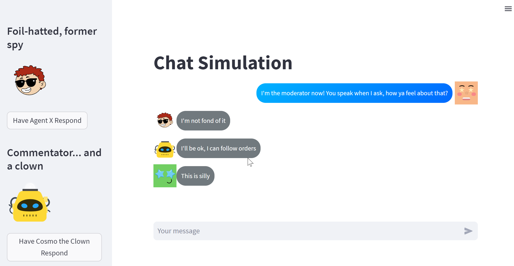
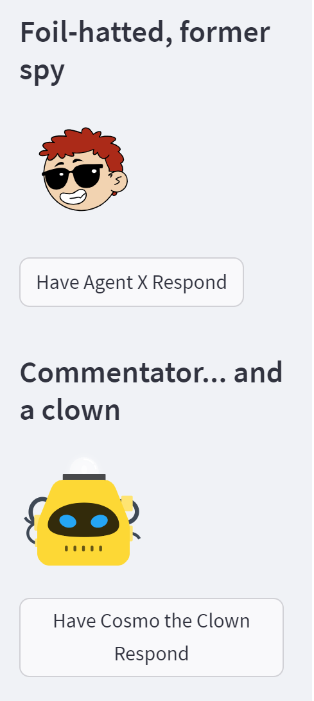
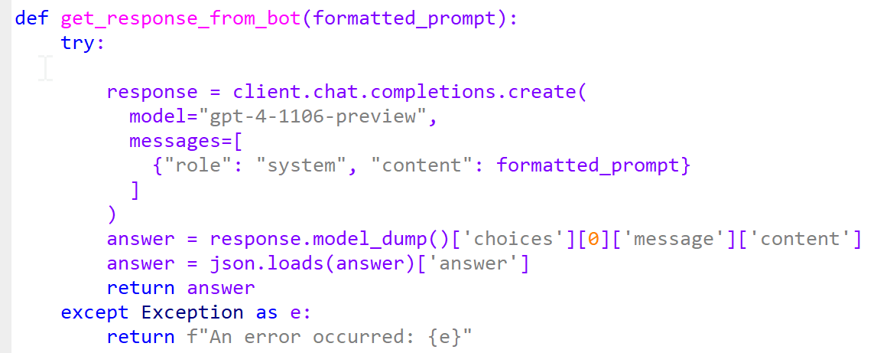

# AI-Moderator
User Interface to have a conversation with multiple bots. Helpful for tuning your agent prompts and visualizing what they are saying. Agents are great, and chaining them together is awesome. But it can be troublesome to let them run wild without watching what they are doing. In this interface, you are the moderator, you determine which bot is next up in the queue and you get to watch their output before moving on.

## How it looks:


## Trigger bot responses manually to moderate the conversation, or troubleshoot chain events


### How to use
* streamlit can be run via command line
``` C:> streamlit run main.py ```
* Add your openai key on prompt_admin.py file.
* You can change the default model in prompt_admin.py file.
  
* Adjust your prompts and backstories in the characters.py file

## Credits
I stole the chat display formatting from Snow Chat:
https://github.com/kaarthik108/snowChat

## 📄 License

This project is licensed under the MIT License - see the [LICENSE](https://choosealicense.com/licenses/mit/) file for details.


